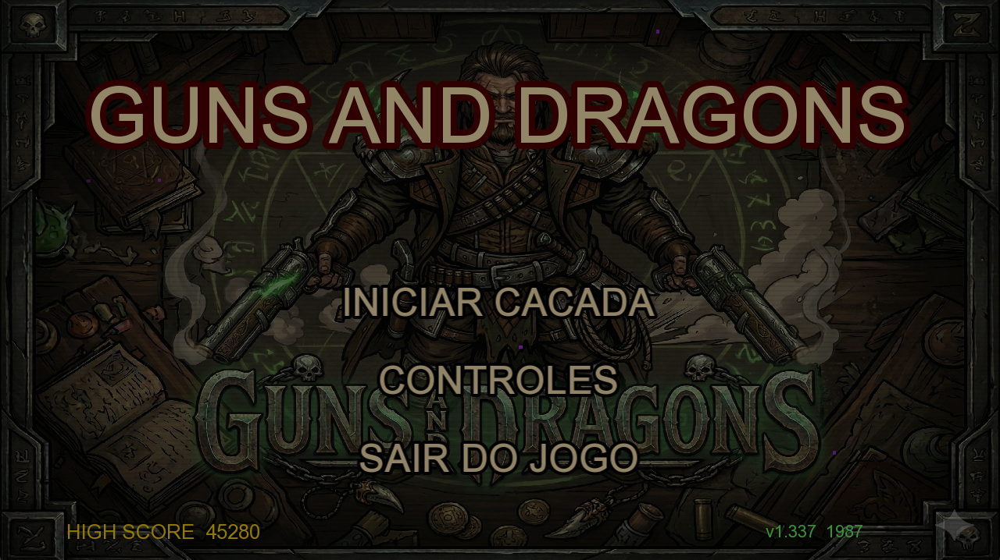
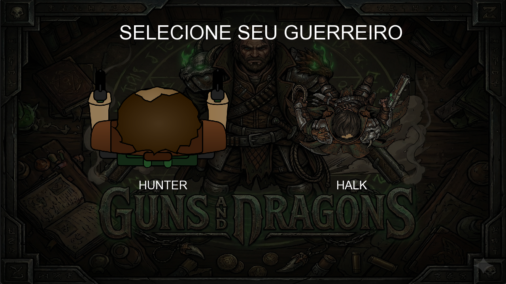

# 🐉 Guns & Dragons

Bem-vindo ao caos absoluto em forma de código!



## ⚠️ AVISO IMPORTANTE (LEIA ANTES DE JULGAR) ⚠️
esse jogo **APRESENTA DIVERSOS BUGS** e o código é uma verdadeira bomba de mais de 2.000 linhas encavaladas no `main.cpp`. 

Eu *literalmente* só fiz esse projeto de sacanagem, com o único objetivo de provar um ponto: **é totalmente possível criar um jogo complexo do zero usando Inteligência Artificial!** Então, se você olhar a arquitetura do código e tiver vontade de chorar sangue, já sabe: o foco aqui foi testar os limites da IA na programação (e a minha paciência com a SFML 3.0)




## 🎮 O que tem nessa maravilha?
* **Halk:** Um personagem que passou metade do desenvolvimento sendo um anão que atirava pelas costas, mas agora finalmente é um tanque de guerra funcional.
* **Dragões:** Dragão necromante, dragão de gelo, dragão colossal, dragão minhoca... é bicho brotando de tudo que é lado MEU PC TRAVOU UMA HORA.
* **Poderes Desbalanceados:** Tem Chuva de Meteoros, Buraco Negro que puxa a gravidade, e um Modo Titan que deixa o personagem bufado.
* **Cena 3D de Level Up (Puro Luxo):** Implementei um efeito de *Voxel Extrusion* improvisado pra simular 3D na hora de escolher os upgrades, só pra tirar onda.

## 🛠️ Como rodar essa bomba (por sua conta e risco)
Se você for corajoso o suficiente para tentar compilar isso e tiver a biblioteca SFML configurada no seu Mingw, reza três Ave Marias e manda isso no terminal:

Nota do Dev: Se na hora de rodar der algum erro de else sem if ou faltar uma chave }, boa sorte tentando caçar isso no meio de 2.200 linhas :D
    
```bash
g++ src/main.cpp -o main.exe -lsfml-graphics -lsfml-window -lsfml-system -lsfml-audio
